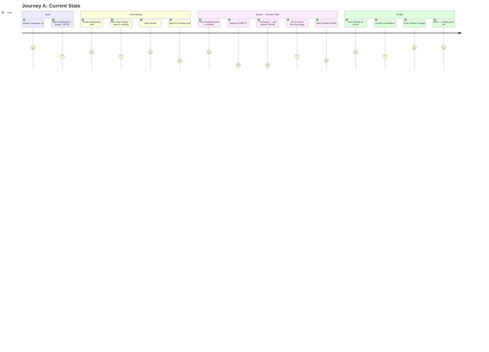
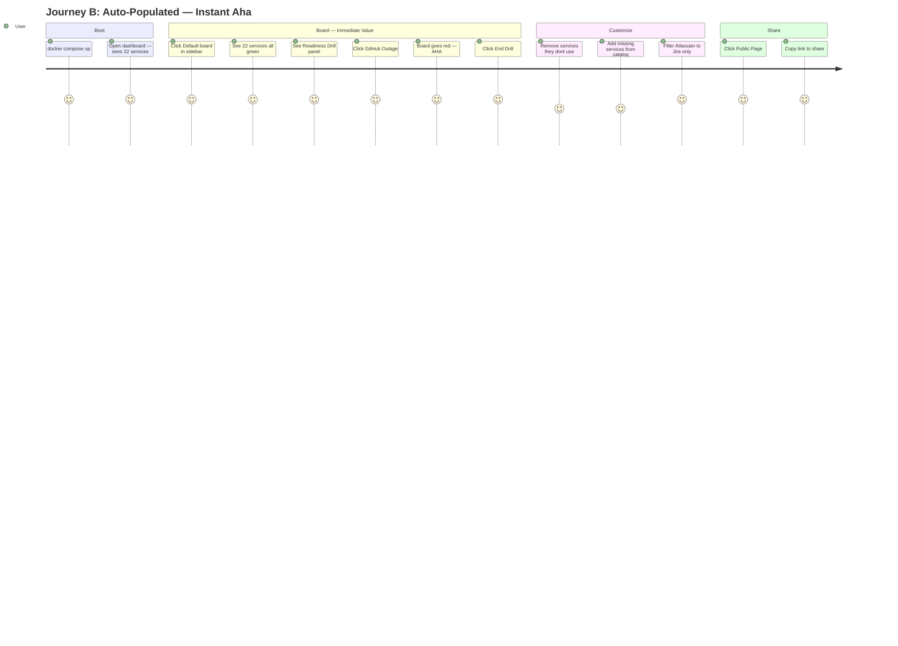
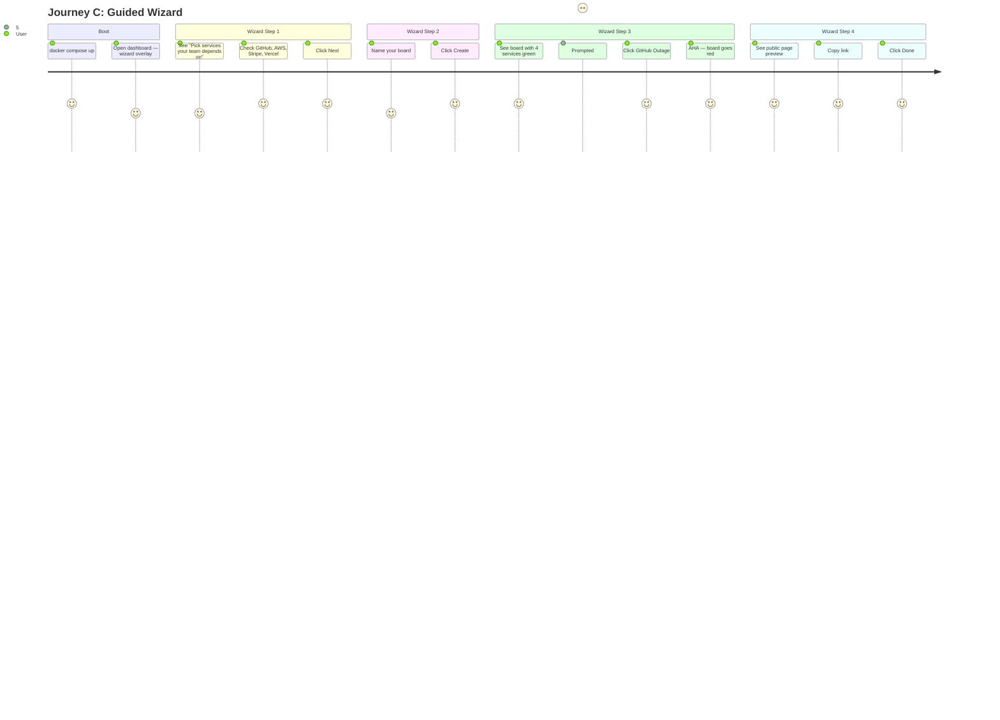
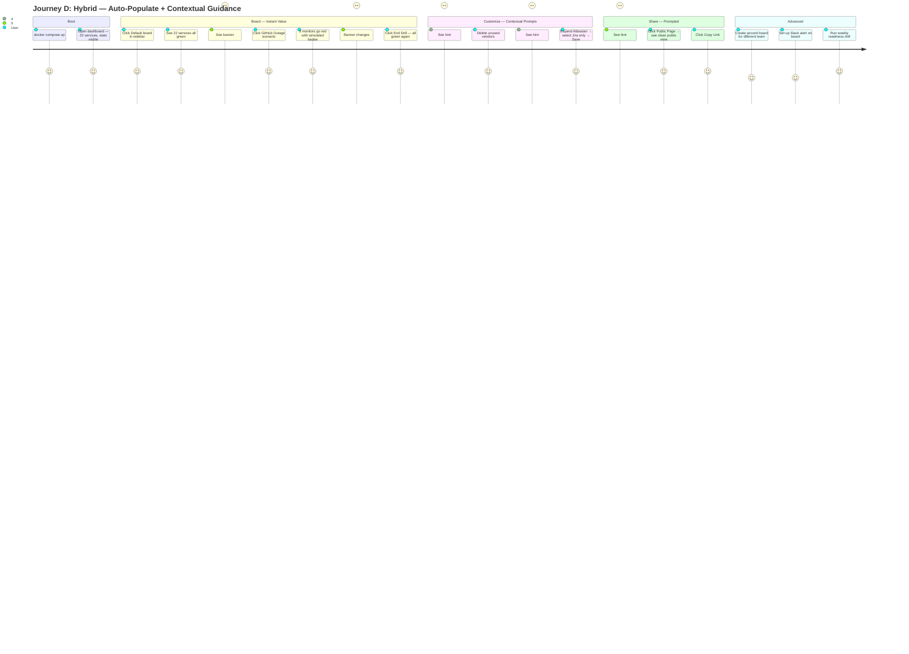
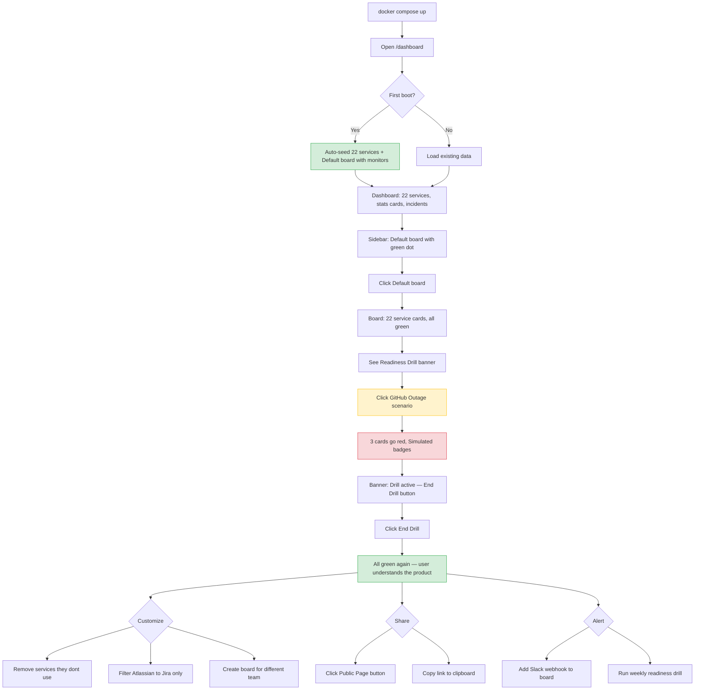

# StatusPulse — User Journey Analysis

## Journey A: Current State (As-Is)

**Clicks to aha: ~8 | Time: ~5 min | Satisfaction: Low**

The user adds a vendor on the dashboard, then has to add it *again* on the board. The aha moment (simulation) is buried behind an empty board.



### Problems
1. **Double-add friction** — user adds vendor on dashboard, then must add monitor on board
2. **Empty board kills momentum** — board exists but has nothing on it
3. **Simulation is invisible on empty boards** — scenarios are shown but do nothing
4. **Restate dependency blocks polling** — without it, services never update
5. **Onboarding doesn't connect to boards** — it focuses on adding vendors, not on the board experience

---

## Journey B: Auto-Populated Board (Proposed)

**Clicks to aha: 2 | Time: ~45 sec | Satisfaction: High**

On first boot, auto-create services from the 22 `defaultEnabled` vendors and auto-add them as monitors on the Default board. User opens the app and immediately sees a populated board.



### Evaluation
| Criterion | Score |
|-----------|-------|
| Time to first value | 9/10 — see populated board in <30s |
| Time to aha moment | 10/10 — 2 clicks (sidebar → scenario) |
| Self-explanatory | 8/10 — board with 22 services makes the product obvious |
| Simulation discoverability | 9/10 — panel is visible, services exist to act on |
| Customization path | 7/10 — remove/add/filter is clear |
| Risk | User overwhelmed by 22 services they didn't choose |

---

## Journey C: Guided Setup Wizard (Alternative)

**Clicks to aha: ~5 | Time: ~2 min | Satisfaction: Medium-High**

A step-by-step wizard on first boot: pick your services → name your board → try a drill → share.



### Evaluation
| Criterion | Score |
|-----------|-------|
| Time to first value | 7/10 — 2 min with wizard |
| Time to aha moment | 7/10 — 5 clicks through wizard |
| Self-explanatory | 9/10 — wizard explains everything |
| Simulation discoverability | 10/10 — wizard forces you to try it |
| Customization path | 9/10 — user chose their own services |
| Risk | Wizard fatigue — users want to explore, not follow steps |

---

## Journey D: Hybrid — Auto-Populate + Contextual Guidance (Recommended)

**Clicks to aha: 2 | Time: ~45 sec | Satisfaction: Highest**

Combine B's instant value with lightweight contextual guidance. No wizard, no steps — just a populated board with smart prompts.



### Evaluation
| Criterion | Score |
|-----------|-------|
| Time to first value | 10/10 — populated board at first load |
| Time to aha moment | 10/10 — 2 clicks |
| Self-explanatory | 9/10 — content makes purpose obvious, hints guide next steps |
| Simulation discoverability | 10/10 — banner + panel + services to act on |
| Customization path | 8/10 — subtract (remove unwanted) is easier than add (build from scratch) |
| Risk | Minimal — user starts with too much rather than too little |
| Implementation effort | Low — seed 22 services + board, add 3 contextual hints |

---

## Comparison Matrix

```mermaid
quadrantChart
    title User Journey Comparison
    x-axis Low Implementation Effort --> High Implementation Effort
    y-axis Low User Satisfaction --> High User Satisfaction
    quadrant-1 Best: High Value, Low Effort
    quadrant-2 Good: High Value, High Effort
    quadrant-3 Avoid: Low Value, High Effort
    quadrant-4 Quick Win: Low Value, Low Effort
    Journey A Current: [0.2, 0.25]
    Journey B Auto-Populate: [0.3, 0.8]
    Journey C Wizard: [0.7, 0.75]
    Journey D Hybrid: [0.4, 0.95]
```

| Journey | Clicks to Aha | Time | Effort to Build | User Satisfaction |
|---------|--------------|------|-----------------|-------------------|
| A: Current | 8 | 5 min | Already built | 4/10 |
| B: Auto-Populate | 2 | 45 sec | Low (seed change) | 8/10 |
| C: Guided Wizard | 5 | 2 min | High (new component) | 7/10 |
| **D: Hybrid** | **2** | **45 sec** | **Medium** | **9.5/10** |

---

## Decision: Journey D — Hybrid

Journey D wins because:

1. **Fastest aha** — tied with B at 2 clicks
2. **Highest satisfaction** — auto-populated board + contextual guidance
3. **Subtractive UX** — easier to remove services than to find and add them
4. **No wizard fatigue** — guidance is inline, not blocking
5. **Reasonable effort** — seed logic + 3 contextual hint banners

### Implementation Checklist

1. **Auto-seed services from `defaultEnabled` vendors on first boot** — before creating board monitors
2. **Auto-create board monitors for all seeded services** — already works once services exist
3. **Drill prompt banner on board** — already implemented (DrillPrompt component)
4. **Customization hints** — add subtle text prompts:
   - On board with >15 services: "Tip: Remove services you don't depend on"
   - On a service with >3 components: "Tip: Filter to the products you care about"
   - After first drill ends: "Tip: Share your public status page →"
5. **Remove double-add flow** — adding a vendor on dashboard should also add a monitor on default board

---

## User Flow Diagram — Journey D Final State


